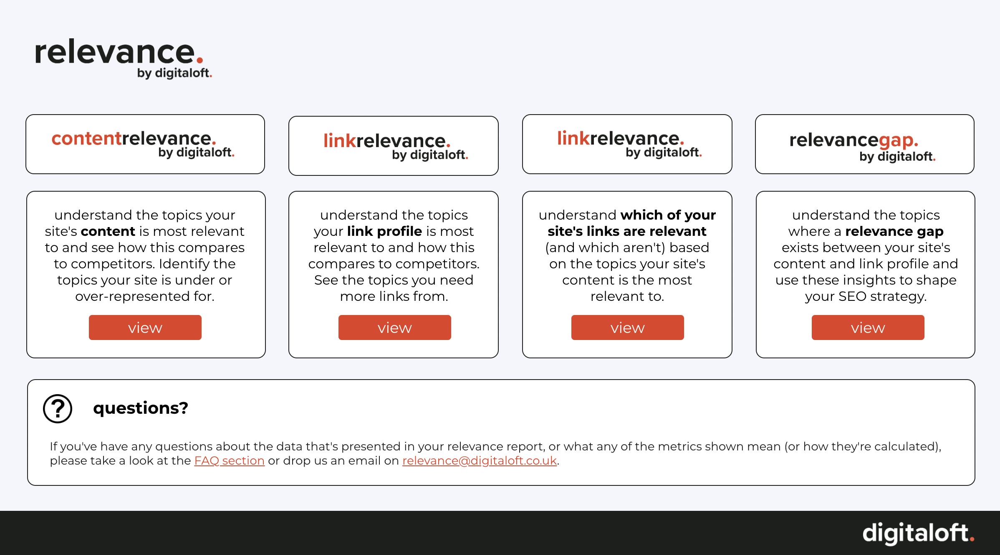
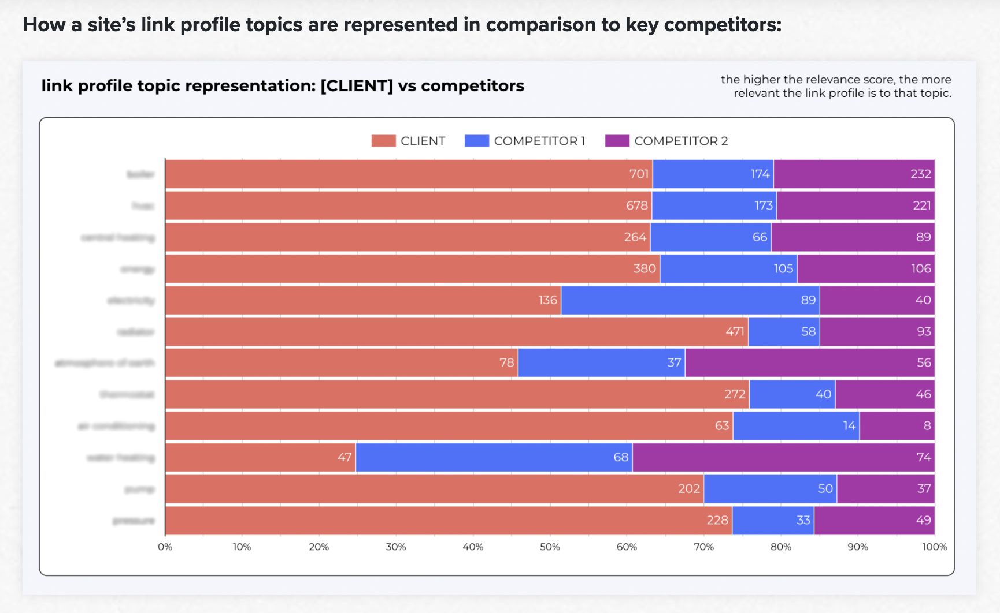
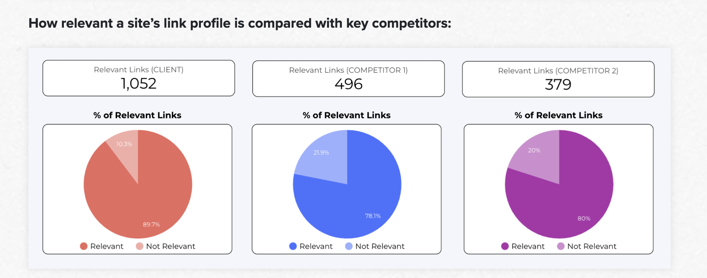

## Portfolio

---

### Project Highlights

[relevance by Digitaloft](/https://digitaloft.co.uk/introducing-relevance-by-digitaloft/)
---
I wrote the code for Digitaloft's groundbreaking link relevance product.

[Clustering Countries Based on World Bank Data](/https://github.com/shez2108/covid/blob/main/MA335_final_project.pdf)

---
[Getting Audience Feedback on Ms. Marvel Using NLP and Social Media APIs](/https://github.com/shez2108/Getting-Audience-Feedback-From-Twitter-and-Reddit-NLP/blob/main/MSc_Dissertation%20(7).pdf)

---
[Visualising Police Data from Dallas, Texas]

---

### Other Projects

- [Using Machine Learning to Analyse Poetry](https://github.com/shez2108/Using-Machine-Learning-to-Analyse-and-Write-Poetry/blob/main/rumi_project%20(2).ipynb)
- [A Look at Affairs Data from the 1960s](https://github.com/shez2108/Affairs-in-1969/blob/main/Affairs_Task_%5BShehzadi%5D_.ipynb)
- Studying Political Echo Chambers with Computational Social Science
- Scraping Tools for MediaVision

---

---

Page template forked from <a href="https://github.com/evanca/quick-portfolio">evanca</a>

<!-- Remove above link if you don't want to attibute -->
