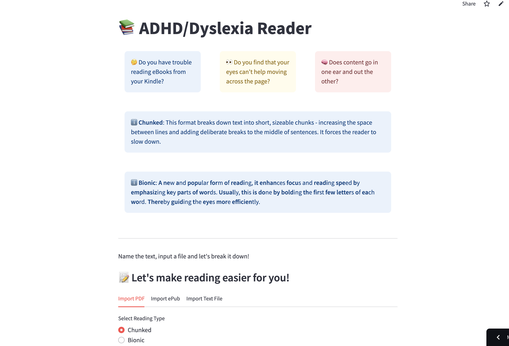
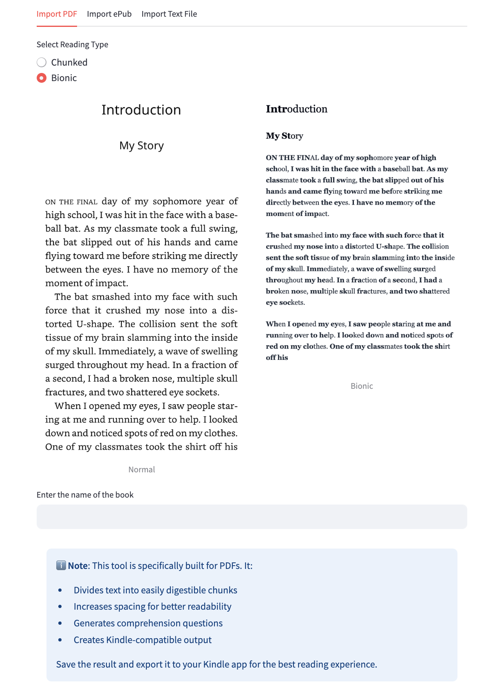
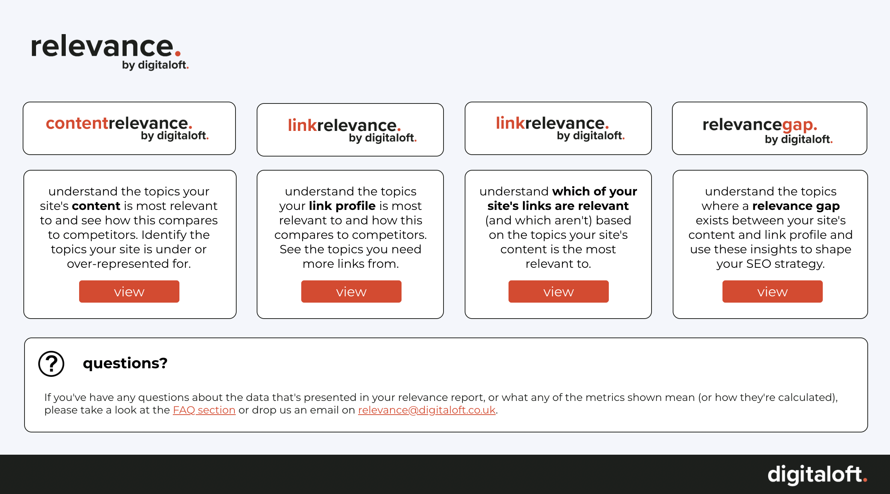
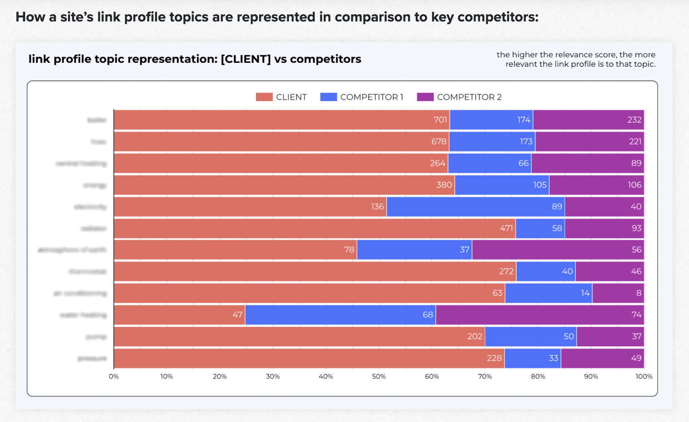
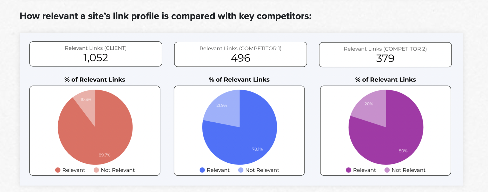

## Portfolio

---

### Project Highlights

<a href="https://chunkitup.streamlit.app/">Assisted Reading App</a> 
---

<a href="https://digitaloft.co.uk/introducing-relevance-by-digitaloft/">NLP Content Strategy Tool for UK-based Marketing Agency</a>
---
Developed backend functionality for a link relevance analysis tool, automating competitive SEO insights and streamlining data processing for large-scale analysis.

### Other Projects

- [Using Machine Learning to Analyse Poetry](https://github.com/shez2108/Using-Machine-Learning-to-Analyse-and-Write-Poetry/blob/main/rumi_project%20(2).ipynb)
- [Getting Audience Feedback on Ms. Marvel Using NLP and Social Media APIs](/https://github.com/shez2108/Getting-Audience-Feedback-From-Twitter-and-Reddit-NLP/blob/main/MSc_Dissertation%20(7).pdf)
- Studying Political Echo Chambers with Computational Social Science
- Scraping Tools for MediaVision

---

---

Page template forked from <a href="https://github.com/evanca/quick-portfolio">evanca</a>

<!-- Remove above link if you don't want to attibute -->
