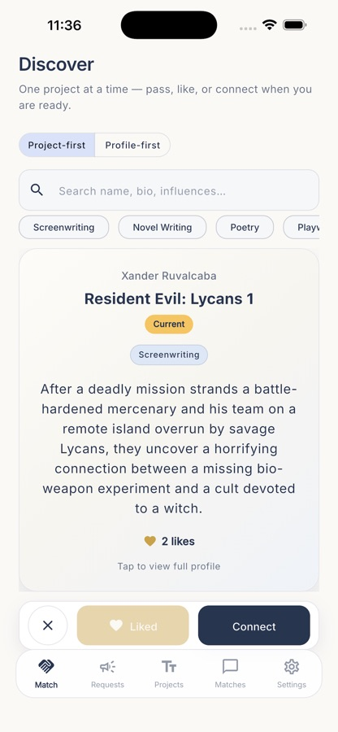
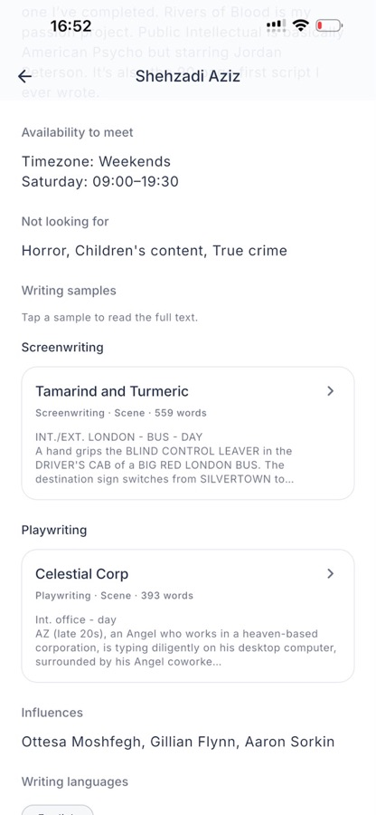
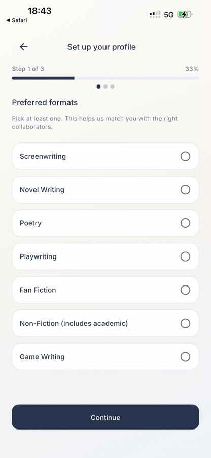
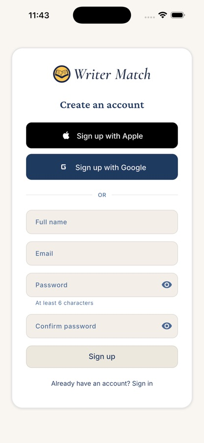
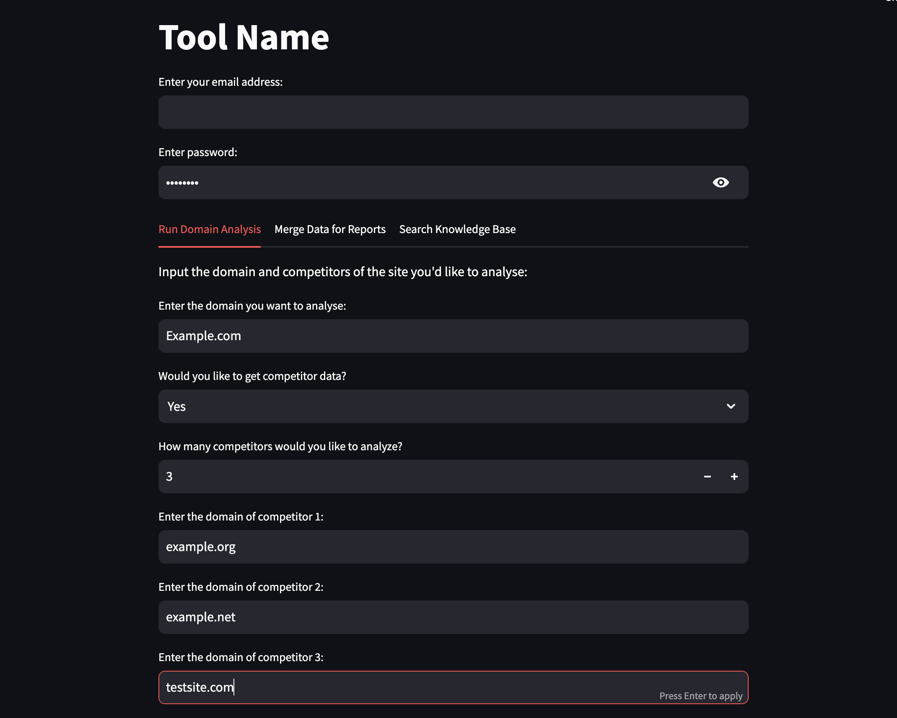

## Portfolio

---

### Project Highlights

**[Writer Match](https://apps.apple.com/gb/app/writer-match/id6768393942)** — live on the iOS App Store
---
A matching app I designed, built, and shipped for writers looking for co-writers, collaborators, and honest feedback. Writers discover people through project-based loglines or full profiles; a three-tier recommendation system ranks compatibility by genre, format, influences, language, and country. Matched writers chat in-app and keep ideas in a project bank they can keep private or open for collaboration.

**Available on the [iOS App Store](https://apps.apple.com/gb/app/writer-match/id6768393942)** (listed under my name) and as a [web app](https://app.writermatchapp.com/).

  

  
  
  
  

<small><a href="https://apps.apple.com/gb/app/writer-match/id6768393942">https://apps.apple.com/gb/app/writer-match/id6768393942</a> · <a href="https://app.writermatchapp.com/">https://app.writermatchapp.com/</a></small>

### Journey Further — product and automation

Internal tools I scoped, built, and rolled out for Digital PR, SEO, and paid social teams. Client names and production UIs omitted.

**PR Landscape 360 Audit Agent**
---
Digital PR teams were spending ~3 days (~22.5 hours) on manual backlink audits — 100+ URLs, one by one. I built a Python pipeline that takes a CSV of backlinks and classifies each URL with structured LLM outputs (syndication, affiliate, tone, genre), then shipped a React app with background cloud jobs and charts so the team could run audits themselves.

  
<strong>~22.5 hrs</strong>manual audit before

  
<strong>~20 hrs saved</strong>per audit after rollout

  
<strong>£3k+</strong>billable hours saved per run

  
<strong>1. CSV in</strong>backlink export from the PR team

  
→

  
<strong>2. Classify</strong>OpenAI structured JSON per URL

  
→

  
<strong>3. Report</strong>charts: syndication, affiliate, tone, genre

Schematic of the workflow — not a screenshot of the production tool.

**Meta ads comments tracker**
---
A fashion advertiser found hundreds of ads attracting inflammatory or prejudiced comments on the creative. I built a dashboard that scanned comments across campaigns, flagged posts with inflammatory language, and produced topic models plus summaries so the team could take ads down or retarget.

  <h4>Comments tracker</h4>
  
Brand A · illustrative mockup, not the production tool

  

    
<strong>847</strong>ads scanned

    
<strong>36</strong>flagged

    
<strong>4</strong>topic clusters

  

  
Campaign · Spring lookbook flagged Appearance-related harassment on model creative. Suggest hide thread / restrict comments.

  
Campaign · Sale film flagged Off-topic argument escalating across 12 replies. Suggest delete thread.

  
Topic model · “appearance”, “authenticity”, “price complaint”, “off-topic pile-on”

Recreated with dummy data. No client ads, comments, or UI were used.

**Also shipped**

<ul class="jf-list">
  <li>
    <strong>Social / Search Excellence</strong>
    Meta ads health-check platform that automated 20+ account checks — e.g. is server-side tracking on, is catalogue match rate at least 90% — and scored each client’s overall account health.
  </li>
  <li>
    <strong>Automated PDP generator</strong>
    For a UK greeting-card retailer whose team was spending 12+ hours a week writing product pages by hand. Gemini API, trained on the retailer’s product schema examples, drafted PDPs in the required format.
  </li>
  <li>
    <strong>Competitor price monitor</strong>
    For a UK beauty brand: 100+ SKUs tracked against two major UK pharmacy and beauty retailers, plus an alert when a product has been discounted for more than 170 of the last 200 days (Google Ads demotion risk).
  </li>
  <li>
    <strong>Social / search audit</strong>
    YouTube channel auditor. Gemini scores how well the channel’s branding and visuals represent the brand, summarised as a radar chart.
  </li>
</ul>

### Prior agency work

<a href="https://digitaloft.co.uk/introducing-relevance-by-digitaloft/">NLP Content Strategy Tool for UK-based Marketing Agency</a>
---
Developed backend functionality for a link relevance analysis tool, automating competitive SEO insights and streamlining data processing for large-scale analysis.

### Personal projects

<a href="https://chunkitup.streamlit.app/">Assisted Reading App</a>
---

- [Using Machine Learning to Analyse Poetry](https://github.com/shez2108/Using-Machine-Learning-to-Analyse-and-Write-Poetry/blob/main/rumi_project%20(2).ipynb)
- [Getting Audience Feedback on Ms. Marvel Using NLP and Social Media APIs](https://github.com/shez2108/Getting-Audience-Feedback-From-Twitter-and-Reddit-NLP/blob/main/MSc_Dissertation%20(7).pdf)
- Studying Political Echo Chambers with Computational Social Science
- Scraping Tools for MediaVision

---

Page template forked from <a href="https://github.com/evanca/quick-portfolio">evanca</a>

<!-- Remove above link if you don't want to attibute -->
